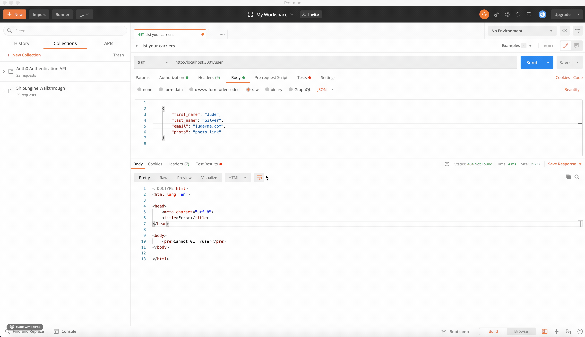

 <h3 align="center">BookSloth Coding Challenge</h3>



<br/>

## About The Challenge

### Task 1

Design the database tables that the Community feature will use. The goal of this task is to reach a correct database schema that could be implemented in MySQL.

Requirements:

- Design a DB schema for the example included above.
- Use a relational database.
- Create all tables, and key constraints in the process.

### Task 2

#### 2.b: Writing a back end application

Build a simple REST API composed of two endpoints.

- GET the discussion thread
  - endpoint should return the following payload:

```
[
  {
    "message": "I just finished reading The Martian and I loved the ending! What do you think?",
    "first_name": "Carlos",
    "last_name": "Diaz",
    "email": "carlos@email.com",
    "photo": "https://booksloth-profilejpg",
    "replies": [...]
  },
  {
    "message": "I think Maven wasn't very likable in Red Queen.",
    "first_name": "Elizabeth",
    "last_name": "Lauren",
    "email": "elizabeth@email.com",
    "photo": "https://booksloth-profilejpg",
    "replies": [
      {
        "message": "Why? I think his actions were very important for his character development. Without it he would never change his original point of view.",
        "first_name": "Maureen",
        "last_name": "",
        "email": "maureen@booksloth.com",
        "photo": "https://booksloth-profilejpg"
      }
    ]
  },
  {
    "message": "I enjoyed Recursion much better that his other book Dark Matter...",
    "first_name": "Lincy",
    "last_name": "L.",
    "email": "lincy@email.com",
    "photo": "https://booksloth-profilejpg",
    "replies": [...]
  },
  {
    "message": "Lady Midnight was amazing and super entertaining! I loved the characters so much!",
    "first_name": "Kat",
    "last_name": "",
    "email": "kat@email.com",
    "photo": "https://booksloth-profilejpg",
    "replies": [...]
  }
]
```

- Post a new post to the Community thread.
- Reply to posts (optional)

#### Requirements:

- Create a small REST API written in [express.js](http://expressjs.com/)
- Use mysql, and connet to the relational database you created in the first step.

### Built With

- [Express](https://expressjs.com/)
- [MYSQL](https://www.mysql.com/)
